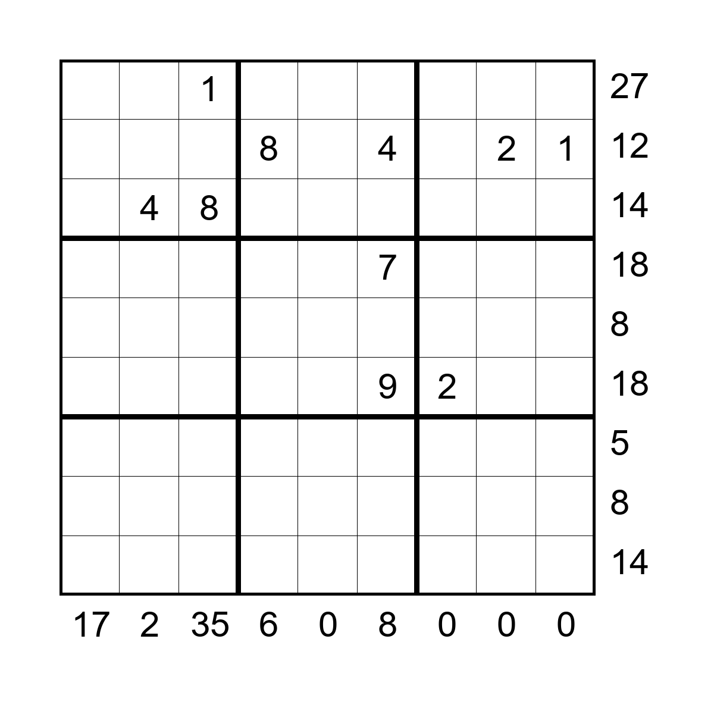

# Sandwich Sudoku
A generator for "sandwich sudoku" puzzles, as seen the in *The Guardian*\
\
Sandwich sudoku follows the same general format as regular sudoku, but has fewer tiles revealed at the start. In order to ensure that the puzzles are still solvable, listed beside each row and under each column is a number. This number is the sum of the numbers between the 1 and the 9 in that row or columns as seen below:

Using this information, one can eventually get to the solution:

\
\
In order to produce these, I downloaded a dataset of over 1 million solved sudoku games from kaggle, then randomly chose a single solved game. Next, the row and column sums were calculated and drawn onto the game, forming the solution picture. To make the puzzle from that, most numbers are removed from the board, leaving just a few hints
